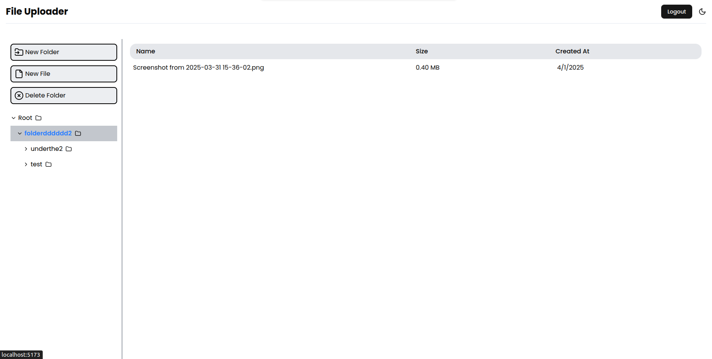
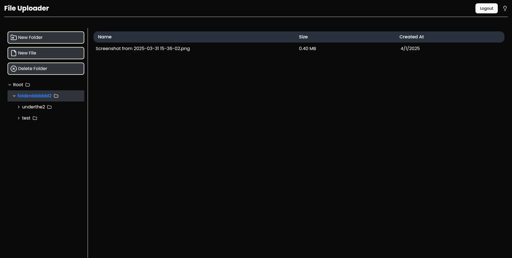
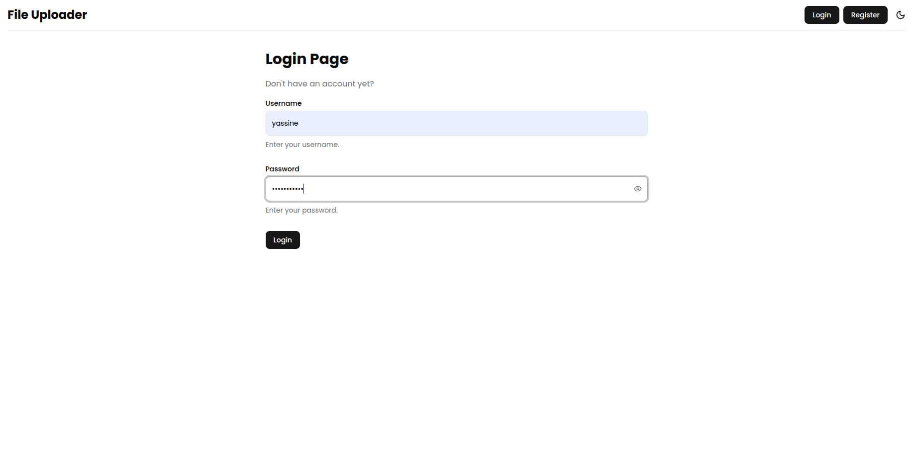

# File Uploader

A web application for file management, storage, and sharing built with React and TypeScript.

## Features

- 📁 **Folder Structure Management**: Create, navigate, and delete folders
- 📄 **File Operations**: Upload, download, and delete files
- 🔗 **File Sharing**: Generate time-limited sharing links
- 🔒 **User Authentication**: Secure login and registration
- 🌓 **Dark/Light Mode**: Toggle between dark and light themes
- 📱 **Responsive Design**: Works on both desktop and mobile devices

## Screenshots

### Home Page

_The main interface where users can manage their files and folders_

### File Details

_View file information and actions_

### Authentication

_Secure user authentication_

### Download Shared File

_download shared file_
